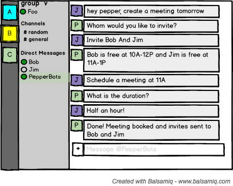

# Problem Statement

In this fast moving software world, the success of a software company can be related to how efficiently the employees use their time. Scheduling meetings is one of the many important things that the employees need to do on a daily basis. Hence, the time invested in planning meetings is a lot. 

Secondly, once the meeting is planned, if a particular attendant of the meeting later notifies about his unavailability, more time is wasted for rescheduling and requesting all other attendees for approval of a rescheduled time. Human effort is also another valuable resource that is invested in this unproductive job of rescheduling meetings, which can affect the business negatively. 

So if the process of planning, resolving conflicts and rescheduling is automated using an interactive bot, the time and efforts can be invested in more productive work which would enhance the business of the company. The managers and the employees would no longer need to waste time looking for a time frame suitable for all employees and asking their approval for the same. 


# Bot Description

BotBai automates the entire process of managing meetings right from finding suitable time slots to resolving schedule conflicts. It can be triggered through a message in slack. BotBai helps a manager to plan a meeting with employees or teams of his choice. The bot goes through the Google Calendars of all listed employees and finds a suitable time slot where everyone listed is available. It will either check their availability for the specified time frame or suggest next possible time slots where all attendees are available. BotBai will also notify all employees about the meeting through a slack notification and put in reminders for the same.

In case there is a situation where the meeting is in place but an attendee has some other important work at the same time, he can inform BotBai about his unavailability. The bot will notify the manager about the problem. The manager can then decide whether to go ahead with the meeting anyway or request BotBai to reschedule or cancel the meeting. If cancelled, all other attendees will get notified by the bot about the cancellation and that time slot on their google calendar will be opened up for other appointments. If a reschedule is requested, BotBai will then scan all google calendars for the next available slot for all attendees and suggest that to the manager. It can also suggest ideas to the unavailable candidate to make changes to his schedule so that he can make time for the meeting. 

Such an interactive bot is a really good solution as it will reduce the manual effort and time required for rescheduling. In big companies, separate secretaries are hired just for planning and rescheduling meetings of the employees. This bot will automate this function and hence, eliminate the overall need to hire secretaries. Hence, BotBai can function as a universal secretary for the company and provide huge monetary benefits.


## Use Cases:
The use cases have been designed to cover the CURD functionality alongwith the additional feature of being able to send a reminder to the attendees.


```
Use Case 1: Create a meeting
1 Preconditions
   All the participating users must have Google Calendar API tokens in the system.
2 Main Flow
   User will request a meeting to be setup with a list of attendees [S1]. Bot suggests possible meeting times after conflict resolution [S2]. The user will confirm one time slot to the Bot [S3]. Bot creates meeting and posts the link to the event [S4].
3 Subflows
  [S1] User gives command to setup a meeting - @bot setup meeting with @user.
  	[S1.1] Bot returns a list of possible meeting times after conflict resolution. ( default day – today )
  	[S1.2] User confirms one time slot from the list.
  	[S1.3] Bot creates a meeting for that particular time slot and posts the link to Google Calendar Event.
  [S2] User gives command to setup a meeting - @bot setup meeting
	[S2.1] Bot asks for what day to schedule the meeting for
	[S2.2] User enters the <day> when to schedule the meeting.
	[S2.3] Bot asks the members to add to the schedule 
	[S2.4] User enters the name of the members via <@user>
	[S2.5] Bot creates a meeting after confirmation ( [S1.1] , [S1.2] , [S1.3] )	
  [S3] User gives command to setup a meeting - @bot setup meeting at <day> with  @user
	Bot creates a meeting after confirmation ( [S1.1] , [S1.2] , [S1.3] )	
4 Alternative Flows
  [E1] Meeting cannot be set as no team members are available.
  [E2] User enters an invalid membername or wants to view a non-registered member’s schedule.
```
```
Use Case 2: Swap a meeting with another meeting
1 Preconditions
   All the participating users must have Google Calendar API tokens in the system.
2 Main Flow
   User will request a meeting to be swapped with another meeting [S1]. Bot checks for conflicts with the new timings for the users involved in both the meetings and suggests possible times [S2]. The user confirms the time slots [S3]. Bot creates the meeting and posts the link to the event [S4].
3 Subflows
  [S1] User gives the command to swap two meetings - @bot swap my 2pm meeting today with 4pm meeting tomorrow.
   [S1.1]   Bot returns a list of possible meeting times for both the meetings in case of conflicts or asks for a confirmation if there's no conflict.
   [S1.2] User chooses possible times for both the meetings and confirms to the Bot.
   [S1.3] Bot swaps the meetings and posts the link for both the events.
  [S2] User gives the command to swap two meetings - @bot swap my meeting
	[S2.1] Bot asks for which day and time, meeting to swap.
	[S2.2] User enters the <day> and <time> of the meeting to swap.
	[S2.3] Bot asks for which day and time meeting to swap with.
	[S2.4] User enters the <day> and <time> of the meeting to swap with.
	[S2.5]  Bot swaps the meetings after doing the steps [S1.1], [S1.2] and [S1.3].
4 Alternative Flows
  [E1] Meeting cannot be swapped because of conflicts.
  [E2] Invalid meeting entry is provided. Thus bot rejects and replies with invalid meeting entered.
```
```
Use Case 3: Cancel a scheduled meeting
1 Preconditions
   All the participating users must have Google Calendar API tokens in the system.
2 Main Flow
   User will request to cancel a scheduled meeting [S1]. If the request came from the organizer, Bot cancels the meeting on confirmation [S2]. Otherwise, Bot asks the organizer to either reschedule, cancel, or ignore the changes to the meeting [S3, S4, S5, S6]. The use case ends when the requested user's meeting has been cancelled.
3 Subflows
  [S1] User asks the Bot to cancel a meeting - @Bot cancel my meeting at 2pm.
   [S1.1] If the user is the organizer, Bot cancels the meeting after confirmation.
          If the user is not the organizer, Bot asks the user to either reschedule, cancel, or ignore any change to the scheduled      meeting.
  [S2] User asks the Bot to cancel a meeting - @Bot cancel my meeting
   [S2.1] Bot asks for the day and time to cancel the meeting .
	[S2.2] User enters the <day> and <time> of the meeting to cancel.
  [S3] Reschedule: Bot suggests possible meeting times and reschedules the meeting.
  [S4] Cancel: If the organizer asks to cancel, Bot cancels the meeting after confirmation [S2].
  [S5] Ignore: If the organizer asks to ignore any changes to the meeting, Bot cancels the requested user's meeting.
 4 Alternative Flows
  [E1] Invalid meeting entry is provided. Thus bot rejects and replies with invalid meeting entered.
```
```
Use Case 4: Send a meeting reminder/ View Agenda
1 Preconditions
   All the participating users must have Google Calendar API tokens in the system.
2 Main Flow
   The user can directly ask Bot to send a reminder for the specific meeting [S1]. Or the user can request the Bot to view his/her agenda [S2]. Bot fetches the calendar meetings and shows it on screen, and sends the reminder to the attendees for the meeting that the user chooses [S3, S4].
3 Subflows
  [S1] User asks the Bot to send a reminder for the specific meeting - @Bot send a reminder to everyone for 2pm meeting.
  [S2] User asks the Bot to view his/her agenda to select a meeting - @Bot show me/@user's today's agenda.
  [S3] Bot fetches the meetings from the calendar and shows it to the user.
  [S4] Bot sends the reminder to everyone for the meeting that the user chooses.
4 Alternative Flows
  [E1] Invalid meeting entry is provided. Thus bot rejects and replies with invalid meeting entered.
  [E2] User enters an invalid membername or wants to view a non-registered member’s schedule.
```


## Wireframe


## Storyboard


# Architectural Design:


## Architecture Components  

* **UI & Client**
  - **#Slack**: The UI for the bot resides in [Slack](https://slack.com/features), which is a cloud based chat app which is typically used by members of a Software Engineering Team. Members can communicate with each other through common chanels or direct messaging. An interesting feature in slack is the provision to add external tools and bots capable of aiding members of the slack team. Few common examples of bots are [WeatherBot](https://slack.com/features), [a list of TODOs](https://ai-se.slack.com/apps/A0HBTUUPK-to-do). Each member of the team needs to register with the bot to assist him/her in creating conflict free meetings.
  - **Google Signup**: Each member while registering with the bot will signup with his/her Google Account via the [Google OAuth UI](https://developers.google.com/google-apps/calendar/auth). This is to enable access to his/her calendar to check for meetings, resolve conflicts and schedule them once resolved.
* **Server**
  The Server is a [REST](https://en.wikipedia.org/wiki/Representational_state_transfer) built using the following technologies
  - **Node**: [Node](https://nodejs.org/) is an asynchronous event driven JavaScript runtime framework which primarily is used for server side programming and is one of the first frameworks to break the notion of JavaScript as a client side programming language.
  - **ExpressJS**: [ExpressJS](https://expressjs.com/) is an additional minimal framework on Node primarily for web based applications that reduces and simplifies REST based calls and caters to an [MVC](https://en.wikipedia.org/wiki/Model%E2%80%93view%E2%80%93controller) architecture.
  
  Since the server is that part of the framework with most fuctionality, we granularize it into three essential components based on its responsibilities. This further complies with the *Template Design Pattern* where there is placeholder for each layer and each layer which can be chosen based on the developers just has to adhere to the template's placeholder.
  - **API layer**: To and from communications with the client happens in this layer.
    - ***REST***: The API for this layer is exposed via REST which allows the client to communicate with the server via HTTP requests. The choice of REST was made over other contemprories like [SOAP](https://en.wikipedia.org/wiki/SOAP) and [GraphQL](http://graphql.org/) due to the following reasons
      * **Stateless**: Since REST is stateless, it makes each request to the server independent of each other thus limiting the data shared and additional bookkeeping.
      * **HTTP based**: Since REST is built on HTTP, it enables users to follow standard HTTP methods like *GET*, *POST* etc and easier validation over the webbrowser.
    - ***Caching***(optional): This is an optional feature we plan on implementing if the base features of our project is completed on time. Here we cache the frequent requests made by the user using [MemCache](https://www.npmjs.com/package/node-cache) or [Redis](https://redis.io/) to help the user with auto complete and thus give him a better chat experience.
  - **Management layer**: This layer is primarily responsible for data Processing and the business logic of the application.
    - ***Wit.ai***: [wit.ai](https://wit.ai/) takes in text or voice and extracts intents and entities from them. It helps in parts of speech recognizing and semantic parsing of the text which can be further used to power the business logic of the application.
    - ***Google Calendar API***: [Google's calendar API](https://developers.google.com/google-apps/calendar/) gives access to a registered user's google calendar. The calendar can be accessed via REST calls.
    - ***Business Logic***: Intent extracted from the text and corresponding data fetched from the Google Calendar API is used to help create meetings and automatically resolve conflicts based on the schedules of the participants. 
  - **DAO layer**: Database Access Object(DAO) layer is responsible for interactions of the server with the database. This layer is responsible for access the database for fetching and updating the information. This is again an implementation based on the Template Design Pattern coupled with the Singleton Design Pattern.
    - ***Template***: This allows us to plugin a different choice of database by simply changing the connector.
    - ***Singleton***: Only a single instance of the database connector should exist to ensure that the write lock on the database is maintained such that the consistency of the database is not violated.
* **Database**
  - **MongoDB**: The choice of the database is a NoSQL key value store primarily because 
      1. It ensures flexibility of storage 
      2. More of a temporary store during the period of conflict resolution 
      3. Good community support with NodeJS
* **Deploy**
  The server and database would be deployed on [digitalocean](https://www.digitalocean.com/) which is part of the [github student plan](https://education.github.com/pack). Each container will be run on Linux Ububtu 16.04 and will be independent of each another
  - Database Container: The database will have an independent container such that if the server goes down the database should not be affected.
  - Primary Server: Container runnning the master instance of the server stack. This will be the server addressing all the requests from the client.
  - Secondary: Container runnning the slave instance of Server. This will act as a back up to the primary server and if the primary server goes down, it will become the primary server.
  
## Constraints  

* **Signup**: All members should signup and give permission for google calendar read/write/delete access
* **Conflicting**: A meeting cannot be booked in a slot if another meeting already exists in the slot.  

## Design & Architectural Patterns
1. [Singleton Pattern](https://en.wikipedia.org/wiki/Singleton_pattern): This creational design pattern is used for ensuring that only a single instance of the DAO object exists at the moment ensuring consistency and upholding the lock. 
2. [Template Pattern](https://en.wikipedia.org/wiki/Template_method_pattern): We use this beahvioral design pattern to model the server's component layers as abstract classes and the eventual implementation can be used as plug and play modules. This allows us to freely change the implementation as long as it complies with the abstract class' template.
3. [Iterator Pattern](https://en.wikipedia.org/wiki/Iterator_pattern): The iterator pattern can be used in the implementation of the business logic to iteratively resolve conflicts for each attendee.
4. [MVC Pattern](https://en.wikipedia.org/wiki/Model%E2%80%93view%E2%80%93controller): The datamodel, client and server respectively form the model, view and controller components of the MVC design pattern.
